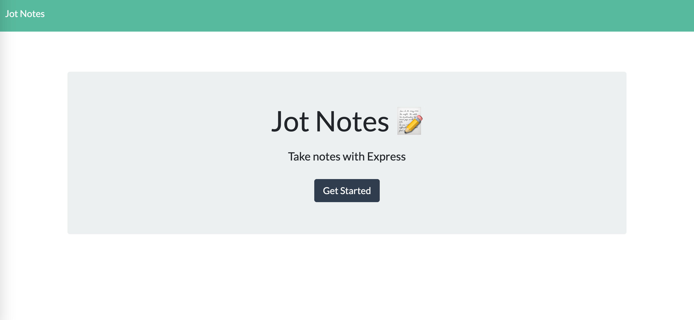
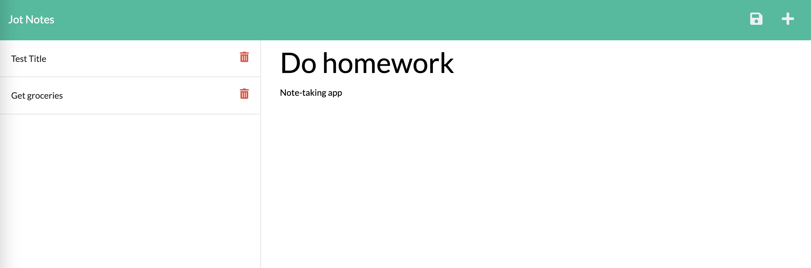

# JotNotes

## Description
JotNotes is a note-taking application built with node.js and express.js that allows the user to record their thoughts, work notes, and activities quickly and cleanly. It is deployed to Heroku. 

* See it live at [JotNotes](https://git.heroku.com/jotnotes29.git) 



## Installation
The application can be viewed live [here](https://git.heroku.com/jotnotes29.git) 

## Usage
* Click the new note button to create a new note, and save the note with the save button. 
* Click on any note in the sidebar to view it again. 
* Delete a note with the delete button.

## User Story

```
AS A small business owner
I WANT to be able to write and save notes
SO THAT I can organize my thoughts and keep track of tasks I need to complete
```

## Acceptance Criteria

```
GIVEN a note-taking application
WHEN I open the Note Taker
THEN I am presented with a landing page with a link to a notes page
WHEN I click on the link to the notes page
THEN I am presented with a page with existing notes listed in the left-hand column, plus empty fields to enter a new note title and the note’s text in the right-hand column
WHEN I enter a new note title and the note’s text
THEN a Save icon appears in the navigation at the top of the page
WHEN I click on the Save icon
THEN the new note I have entered is saved and appears in the left-hand column with the other existing notes
WHEN I click on an existing note in the list in the left-hand column
THEN that note appears in the right-hand column
WHEN I click on the Write icon in the navigation at the top of the page
THEN I am presented with empty fields to enter a new note title and the note’s text in the right-hand column
```

